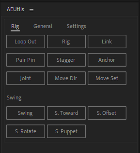

- [AEUtils](#aeutils)
  - [User Installation](#user-installation)
  - [Dev Environment Setup](#dev-environment-setup)
    - [Requirements](#requirements)
    - [Set up](#set-up)
    - [Lint and Test](#lint-and-test)

# AEUtils

A collection of AE scripts for quickly making smooth, looping animations.

## User Installation

1. Go to [Releases](https://github.com/jamos-tay/aeutils/releases/)
2. Download the latest `AEUtils.jsx` file
3. Copy it to your After Effects Script folder
    - Should be like `C:/Program Files/Adobe/Adobe After Effects 20XX/Support Files/Scripts/ScriptUI Panels/AEUtils.jsx`
4. Open After Effects, click Window in the menu bar at the top and click `AEUtils.jsx`.

See the [User Guide](user_docs.md) for more information.

## Dev Environment Setup

*Note: This is for those who want to modify the plugin functionality. If you're just looking to use the plugin you don't need to perform these steps!*

### Requirements
- node.js v16

This app uses rollup to monitor for changes to the `src` folder, and automatically compiles the plugin to `build/AEUtils.jsx` and to the AE script folder (path specified in `rollup.config.js`).

### Set up
1. Run `npm ci`
2. Update the path in `rollup.config.js` to your AE script folder
3. Run terminal as administrator, `npm run watch`
    - Changes to `src` will immediately be updated in After Effects. Close the plugin window and reopen it to see them.
    - **Note: You need to run as admin to copy the plugin to a protected folder (Program Files). If you don't want to do this you will have to copy build/AEUtils.jsx to your script folder manually.**

### Lint and Test
- `npm run lint`
- `npm run test`
