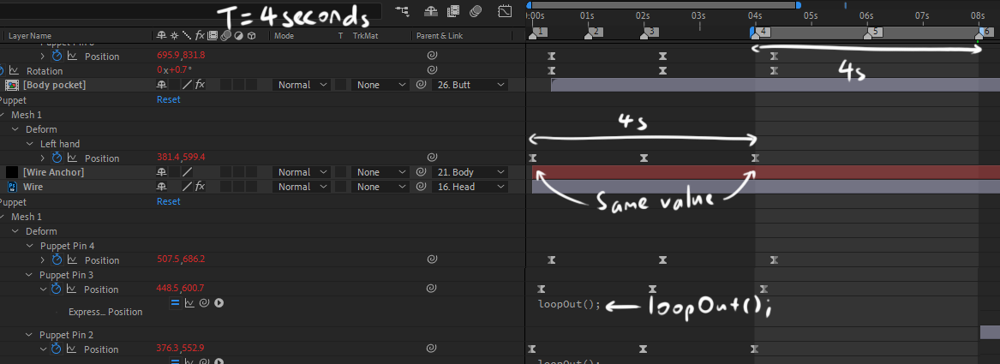
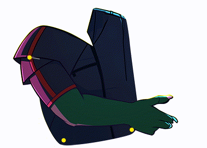

# Quick Start

- [Quick Start](#quick-start)
- [Introduction](#introduction)
  - [Making a Looping Animation](#making-a-looping-animation)
  - [Rigging](#rigging)
  - [Movement](#movement)
    - [Manual](#manual)
    - [Automated](#automated)

# Introduction

This section will give a quick demo of how I use the plugin in my workflow.

Let's see how we can animate a simple upper body consisting of the following layers in just a few steps.

## Making a Looping Animation

There's multiple ways to make a perfect loop, but how I do it is using the `loopOut()` expression.

Choose a loop length (say T = 4 seconds), then set the work area to be length 4s and slightly further to the right.

For all animated properties, I create a 4 second keyframe loop. That is:
- The first and last keyframe is 4 seconds apart (or some fraction like T/2, T/3, T/4 ...),
- The first and last keyframe is the same,
- The `loopOut()` expression is applied.

If these conditions are met, your work area is guaranteed to be a perfect loop.

Let's create a 4 second loop. Set the `Loop Length` under settings to 4, and set up your work area so it's 4 seconds long.

## Rigging

Now, let's set up rigging. To do this, use the `Rig` button under the Rig tab.

Rig: *Rigs a layer to a puppet pin on another layer. Select a layer and a puppet pin.*

The rig function rigs a layer to a puppet pin on another layer. You can think of it as puppet pin parenting, where the child layer not only inherits the parent's Transform properties, but also the movement of the puppet pin:

This can be used as a basis for creating a simple skeleton. The Body is rigged to the Legs, the Arms and Neck to the Body and the Head to the Neck and so on.

So now, let's figure out which layers should be rigged to which, and at which position:

- The Right Arm and Right Wing should be rigged to the Body's right side.
- The Left Arm and Left Wing should be rigged to the Body's left side.
- The Neck should be rigged to the Body's top.
- The Head should be rigged to the Neck's top.

Create your puppet pins as described above.

Now, to do the rigging. Select the layers marked with a circle, select the puppet pin marked with an arrow and click `Rig`.

There's no animation yet, but here's how it looks when it's moving. The Body's puppet pins are marked with yellow, and the Neck's puppet pins are marked in orange. Notice how the rigged layers move with the labelled puppet pins.

Some extra puppet pins are added to stabilize the movement.

## Movement

Now that the rig is set up, we can start adding animation.

### Manual

If you like, you could just drag puppet pins and add key frames like you would normally.

As described previously:
- Create a keyframe at 0s.
- Move the puppet pin and create a keyframe at 2s (half your loop length).
- Copy the keyframe at 0s to 4s.
- Apply the `loopOut();` expression. The [`Loop Out`](./user_docs.md#loop-out) button does this too.

Do that for all 4 pins and you might get something like this:

However, that's a lot of repetitive clicks. Another way to create this simple keyframe loop is to use the `Move Arc` function.

### Automated

Move Arc: *Creates a 2 keyframe loop that moves the selected item's position by a fixed amount of pixels, in a fixed direction (0 - 12, like a clock face). Select any Position property (layer Position or puppet pin Position).*

Move Arc creates a simple round back-and-forth animation between 2 positions, exactly the same as before, but the main benefit is this rounds the movement in an arc.

The script will prompt you for an input in the form `x,y`.
  - The end position is calculated based on the input `x,y`. `x,y` means move x pixels in y direction, where y is the "clock direction".
    - e.g. 40,9 would move 40 pixels to the left.
    - This corresponds to your keyframe at 2s.

Select the position property on each puppet pin and click `Move Arc`:
- Left Arm: 20,3
- Right Arm: 20,3.5
- Neck: 20,3
- Head: 15,3

This leads to a more natural looking loop rather than a "boomerang" effect you might get from doing it manually:

Lastly, the head looks a little loose so lets fix that. The head should rotate slightly when the character leans back and forward, say from -3° to +3°. We can do this using `Move Set`.

Move Set: *Creates a 2 keyframe loop that animates the selected property's value between two given values (e.g. 10;20). Select any animatable property.*

Select the Head's Rotate property, then click Move Set. The script will prompt you for an input, type `-3;3`.

And there we go! This should give a base movement for the rest of the animation, so simply explore from there!

I recommend checking out the following to start with:
- [`Swing`](./user_docs.md#swing)
- [`Joint`](./user_docs.md#joint)
- [`Scale`](./user_docs.md#scale)
- [`Stagger`](./user_docs.md#stagger)

Thanks to [@masterblader191](https://twitter.com/masterblader191) for allowing me to use his art for the tutorial examples!
