# User Documentation

- [User Documentation](#user-documentation)
- [Foreword](#foreword)
- [Using the Plugin](#using-the-plugin)
  - [Errors](#errors)
- [Rig](#rig)
  - [Loop Out](#loop-out)
    - [Making a Looping Animation](#making-a-looping-animation)
  - [Rig](#rig-1)
  - [Link](#link)
  - [Pair Pin](#pair-pin)
  - [Stagger](#stagger)
  - [Anchor](#anchor)
  - [Joint](#joint)
  - [Move Arc](#move-arc)
  - [Move Set](#move-set)
  - [Swing](#swing)
  - [S. Toward](#s-toward)
  - [S. Offset](#s-offset)
  - [S. Rotate](#s-rotate)
  - [S. Puppet](#s-puppet)
- [General](#general)
  - [Scale](#scale)
  - [Loop Cmp](#loop-cmp)
  - [Loop Evo](#loop-evo)
  - [Clear Exp](#clear-exp)
  - [Add Noise](#add-noise)
  - [Slider](#slider)
  - [Wiggle](#wiggle)
- [Experimental](#experimental)
  - [Parallax](#parallax)
  - [Chain](#chain)
  - [Create Ref](#create-ref)
  - [Stitch](#stitch)
  - [Round](#round)
  - [Graph Spd](#graph-spd)
- [Settings](#settings)
  - [Loop Length](#loop-length)
  - [Speed %](#speed-)
  - [Round %](#round-)
  - [Flip Handles](#flip-handles)
- [Etc](#etc)
  - [Optimization Tips](#optimization-tips)
    - [Parenting](#parenting)

# Foreword

I use After Effects for creating idle animated loops. This involves cutting up existing artwork into layers in Photoshop, rigging them in After Effects and then finally animating them. It's not a complicated process, but I faced a few problems:

- Layer management: An average project will have about ~50 layers. Many animation workflows require you to create more, and it made finding specific objects painful.
- Rigging: Standard rigging methods take a long time to setup. The resultant rig is powerful but it's not needed for a simple idle loop.
- Repetitive work: There's a lot of repetitive work which is really boring, and makes animating a drag.

Many existing workflows are targeted towards traditional animation (like walk cycles, etc.) which is not really suited to this use case. As such, I created this plugin with these goals in mind:

- Keep the workspace clean. Build functionality in a way that doesn't add new objects to manage (like layers and comps).
- Keep it simple. Make rigging and movement doable in just a few clicks.
- Automate the unimportant stuff. The 80:20 rule - 80% of the result comes from 20% of the work. For the rest? Automate it.

Getting rid of these pain points went a long way in making the animation process enjoyable.


Thanks to [@masterblader191](https://twitter.com/masterblader191) for allowing me to use his art for the tutorial examples!

# Using the Plugin

The plugin consists of buttons each linked to a script or functionality. To use a script, select the required properties in the timeline panel and click on the respective button.

Tips:
- Hover over a button to see a description of what it does.
- Buttons will usually require you to select some thing(s) in the timeline before clicking the button.
    - Hovering over a button will tell you what needs to be selected, e.g., the Anchor button will require you to select a puppet pin.
    - An error will show if the selection is incorrect.
- Some buttons require user input (in a specific format). Check each script's documentation for what it expects.

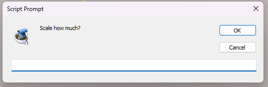

- Some buttons will read a value from the Settings tab which will affect functionality, such as the loop length. Check each script's documentation for which settings are read.

## Errors

If you're encountering errors:

- IMPORTANT: This plugin was intended to be used on Photoshop layers, most rigging functionality will only work on layers imported on photoshop (i.e. the layer size is the same as the composition). As such many rigging functions won't work on layers whose height and width does not match the composition.
    - Ensure that you import your .psd is imported as `Composition`, and not `Composition - Retain Layer Sizes`.

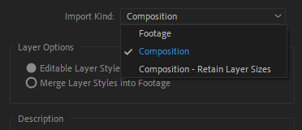

- If rigging is being weird, reset your layer(s) transform properties (Position, Anchor, Rotation, Scale) to default values and try again.
- Check that you've selected the correct properties.
- Check that you haven't accidentally selected just the property's parent, e.g., if the script needs a Position property selected:

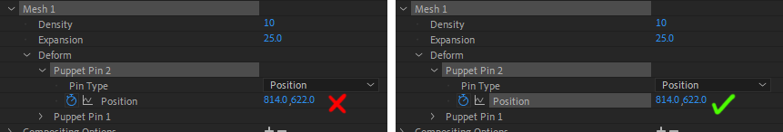

- Check that the settings and inputs are valid. Read each script's documentation for more information.

# Rig

The rig plugin contains functionality based on rigging layers together. It provides a simple rigging engine based off puppet pins and property expressions.

*IMPORTANT: This plugin was intended to be used on Photoshop layers, most rigging functionality will only work on layers imported on photoshop (i.e. the layer size is the same as the composition). As such many rigging functions won't work on layers whose height and width does not match the composition.*

## Loop Out

*Sets loopOut() on all selected properties with at least two keyframes and no expression.*

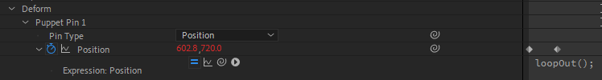

Sets all selected properties and their children to `loopOut()`, which makes the keyframes loop endlessly.

Only affects properties that are animated (i.e. 2 or more keyframes), and does not overwrite existing expressions.

This is integral to how I make looping animations.

### Making a Looping Animation

Choose a loop length (say T = 4 seconds), then set the work area to be length 4s and slightly further to the right.

For all animated properties, I create a 4 second keyframe loop. That is:
- The first and last keyframe is 4 seconds apart (or some fraction like T/2, T/3, T/4 ...),
- The first and last keyframe is the same,
- The `loopOut()` expression is applied.

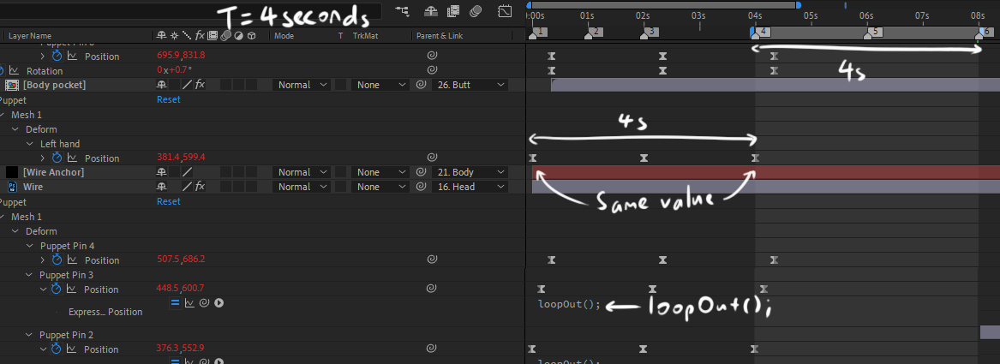

If these conditions are met, your work area is guaranteed to be a perfect loop. It's annoying to put `loopOut()` on everything but there's some benefits to doing it this way:

- Keyframe loops don't have to start at the same time. This lets you offset your keyframes which leads to a smoother animation.
- It's not affected by keyframe easing.
- You use the minimum number of keyframes per property. This makes tweaking things easier.
- You can use multiples of your loop length, e.g. (4s, 8s, 12s...)

*Advanced tip: What if you need a different expression on a property?*

Did you know `loopOut()` (and many other AE expressions) can be used to substitute the property's default expression?

For example:
```
effect("Puppet").arap.mesh("Mesh 1").deform("Puppet Pin 1").position + [5, 0]; // Adds 5px to the puppet pin's x value
```
can be replaced with
```
loopOut() + [5, 0]; // Adds 5 px to the puppet pin's x value, then makes it loop
```

## Rig

*Rigs a layer to a puppet pin on another layer. Select a layer and a puppet pin.*

The rig function rigs a layer to a puppet pin on another layer. You can think of it as advanced parenting, where the child layer not only inherits the parent's Transform properties, but also the movement of the puppet pin:

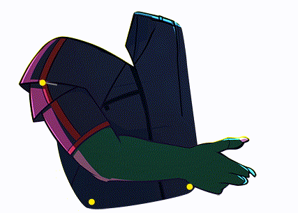

This can be used as a basis for creating a simple skeleton. The Body is rigged to the Legs, the Arms and Neck to the Body and the Head to the Neck and so on.

## Link

*Links a puppet pin (child) to another puppet pin's (parent) absolute position, ignoring all parenting. Select two puppet pins on different layers.*

This forces a puppet pin to always be at the same position as a different puppet pin on a separate layer.

To use it, place two puppet pins on two layers at the same position. Then, select them both and clink 'Link', and it will ask you to confirm which is which. The child pin will be linked to the parent pin.

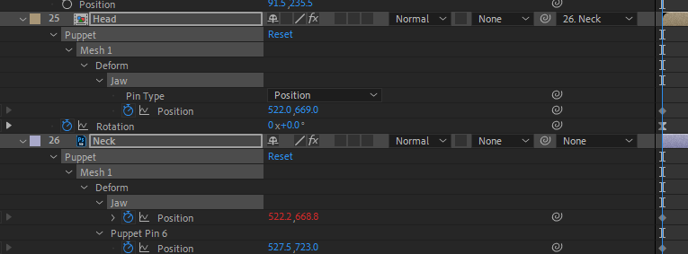

This is handy for joining layers at multiple points, thus allowing them to feel more connected.

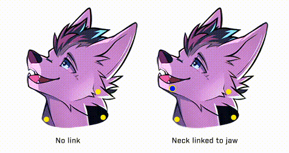

The head is rigged to the neck's upper right pin. The jaw puppet pin on the neck is linked to a puppet pin placed on the head, resulting in a smoother looking connection.

*See also [Parenting](#parenting)*

## Pair Pin

*Pairs a puppet pin (child) to another puppet pin (parent) so the child pin moves with the parent. Select two puppet pins on the same layer.*

Pair pin allows for puppet pin level parenting without parenting to null objects. It forces a puppet pin (child) on a layer to move relative to a different puppet pin (parent) on the same layer. Multiple child pins can be parented to one parent pin.

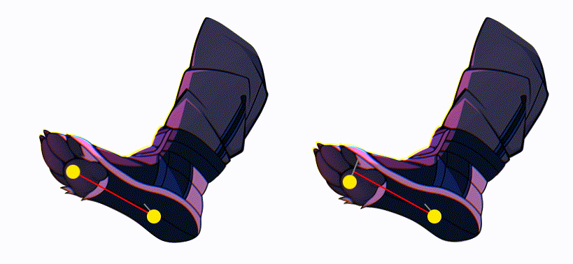

Additionally, if the child pin has its own animation the movement will be stacked, much like layer parenting. 

Note: AE glitches out a bit if you try to move child pins that have already been parented. You have to adjust the position in the timeline, or animate the child pin first before animating. I'm still looking for a fix.

*See also [Parenting](#parenting)*

## Stagger

*Staggers the start time of animated properties so their first keyframe starts at 0, n, 2n, 3n... etc. frames. Select multiple properties with keyframes.*

This is used to offset the start times of multiple selected properties. The lowest selected property will be the earliest.

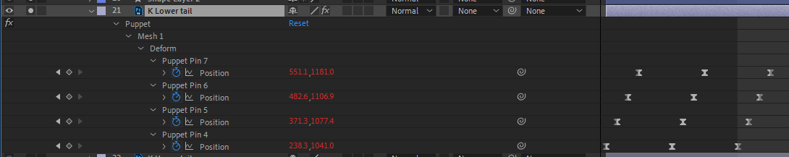

Staggering start times of looping keyframes is a lazy way of adding momentum. You'll see this used in `Swing` as well.

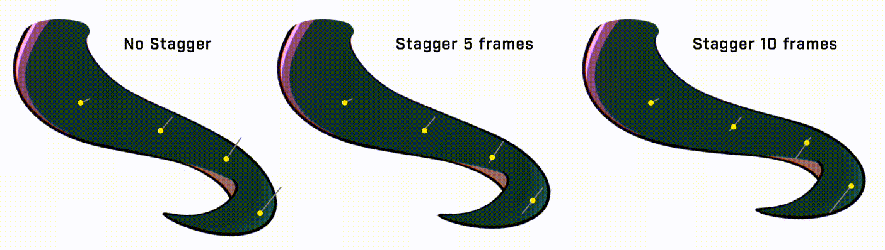

## Anchor

*Anchors a puppet pin to its current position on the composition so it does not move. Select 1 or more puppet pins.*

This forces a puppet pin to stay stationary in the composition regardless of how the layer moves. Helpful for fixing a part of a layer to a point (say a hand leaning on a wall).

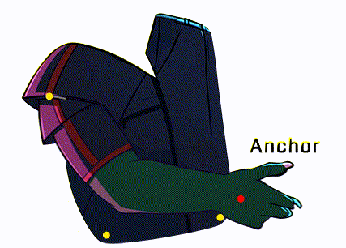

If you select `Movable Anchor`, the anchor will be attached to a null object instead, which can be animated independently.

## Joint

*Sets up inverse kinematics on the selected puppet pins. Select 3 (Anchor, Joint, Controller) or 4 (Anchor, Joint, Inner Joint, Controller) puppet pins. Please see the user guide for more information.*

Joint sets up a quick and dirty 2 joint IK, useful for animating limbs. In each of the following, only the wrist is animated with keyframes:

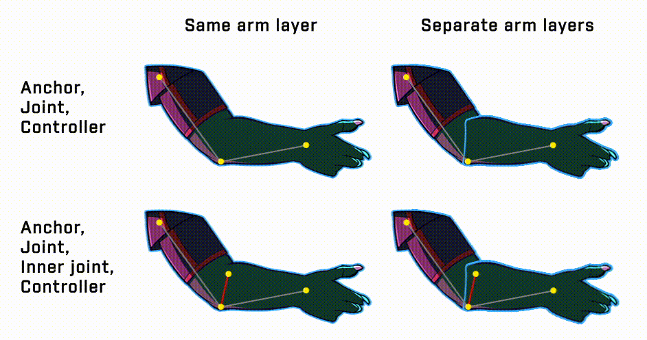

Start by placing specific puppet pins on your arm layer(s). These are:
- Anchor: The shoulder, also the anchor point of the limb
- Joint: The elbow, where the two halves of the arm connect
- Inner joint (optional): Paired to the joint, allowing a smoother connection
- Controller: The wrist, which can be animated

Select either the 3 (Anchor, Joint, Controller) or 4 (Anchor, Joint, Inner joint, Controller) puppet pins, and click Joint to rig them up.

Additionally, the forearm and arm can be on separate layers. This will instead create a null object which the Controller is attached to.

Do note:
- Joint and Inner Joint points must be placed on BOTH layers at approximately the same position.
- Select the Joint and Inner Joint that's on the same layer as the anchor.

Here's how the selection should be done before `Joint` is clicked:
- (Top Left) Arm and forearm on same layer. No inner joint
  
    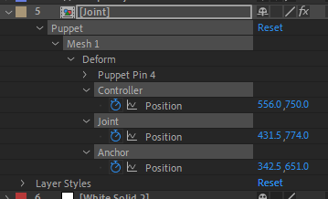
- (Bottom Left) Arm and forearm on same layer. Inner joint
  
    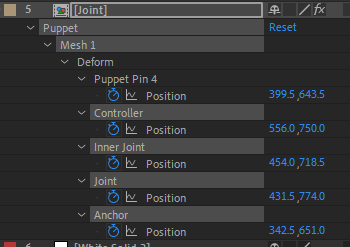
- (Top Right) Arm and forearm on separate layers. No inner joint
  
    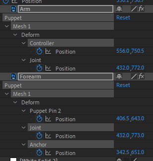
- (Bottom Right) Arm and forearm on separate layers. Inner joint
  
    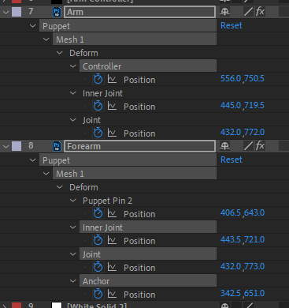

Note: You will get an error if your Controller (wrist) is dragged too far from the Anchor (shoulder). The elbow can't be placed without breaking the arm.

## Move Arc

*Creates a 2 keyframe loop that moves the selected item's position by a fixed amount of pixels, in a fixed direction (0 - 12, like a clock face). Select any Position property (layer Position or puppet pin Position).*

Move Arc creates a simple round back-and-forth animation between 2 positions. Has plenty of use cases.

The main benefit is this rounds the movement in an arc. This leads to a more natural looking loop rather than a "boomerang" effect you might get from doing it manually:

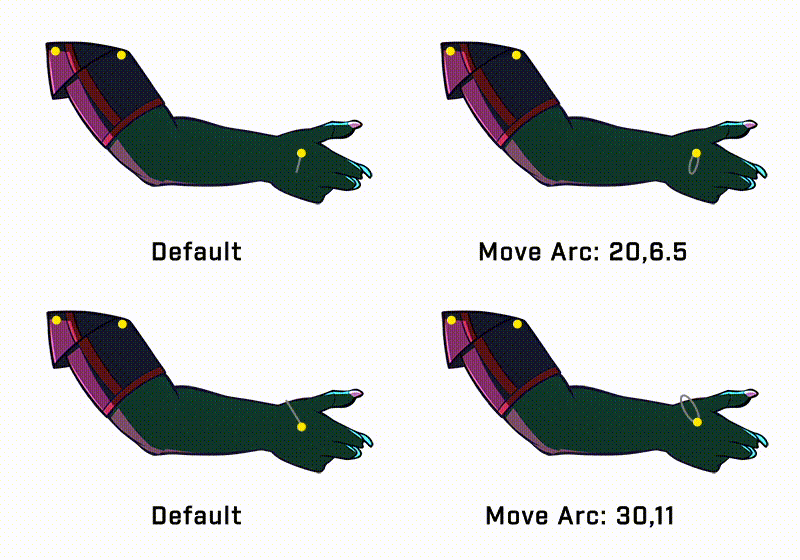

This does 3 things:
- Clears all keyframes and creates 3 keyframes (Start pos => End pos => Start pos).
    - The end position is calculated based on the input `x,y`. `x,y` means move x pixels in y direction, where y is the "clock direction".
    - e.g. 40,9 would move 40 pixels to the left.
- Sets handles on the keyframes to round out the path. The roundness depends on the [Round %](#round-1) setting.
- Bumps up the minimum speed so it isn't 0 at keyframes. The minimum speed depends on the [Speed %](#speed) setting.

The [Flip Handles](#flip-handles) setting can be used to reverse the direction of the loop if needed.

## Move Set

*Creates a 2 keyframe loop that animates the selected property's value between two given values (e.g. 10;20). Select any animatable property.*

Similar to above, but just sets up a no-frills back and forth loop with easy ease applied. Nothing spectacular, but this pops up quite a lot so it saves some time.

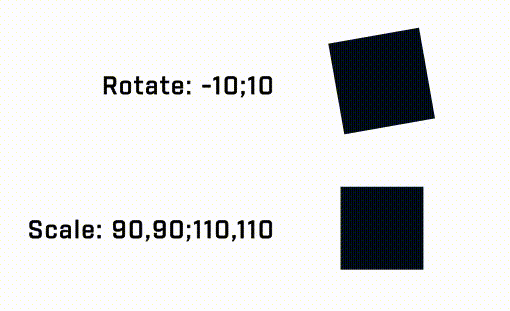

Input the start and end value separated by `;`. If it's a 2D or 3D property, separate each dimension with `,`.

## Swing

*Creates a 2 keyframe loop that rotates puppet pins back and forth around the layer's anchor point. The degree specifies how much to move and the stagger specifies the delay between each puppet pin's animation. Select any number of puppet pins on a layer.*

Swing makes puppet pins sway back and forth. Use it for fur, hair, clothes and other flexible body parts.

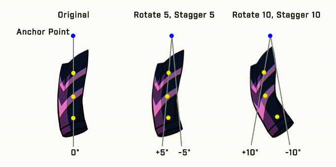

Swing requires two inputs, the Rotation and Stagger values. It works by setting 2 key frames on the selected puppet pins, one at +Rotation and -Rotation around the layer's Anchor Point, and then staggering the keyframes by a number of frames to offset the start time.

Basically:
- Rotation determines how much the puppet pin moves.
- Stagger determines how much delay there should be between each puppet pin's loop.

The points don't necessarily need to be in a straight line. A handy tip is to think of them radiating outwards from the anchor point. This gives a wavy effect:

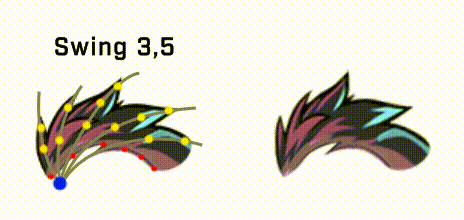

The next 4 controls are just variations on swing that are used in specific cases. I wouldn't worry about them too much, just use `Swing`.

## S. Toward

*Same as swing, but the puppet pin moves towards and away from the anchor point instead of rotating around.*

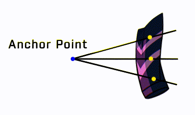

Useful in cases where the layer is anchored at both ends, for example wires on a telephone pole.

## S. Offset

*Same as swing, but you can specify the start and end degrees. E.g. (0 to 12 instead of -6 to 6).*

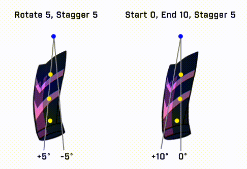

The above shows a regular `Swing` compared to `Swing Offset`. Helpful sometimes when you need to control the angle of swing.

## S. Rotate

*Same as swing, but each puppet pin will be rotated around the previous puppet pin by a specified amount. Puppet pins are ordered from bottom to top by how they're displayed on the Timeline.*

Slightly more complicated. Each pin is rotated a specified number of degrees around the previous pin in the chain.

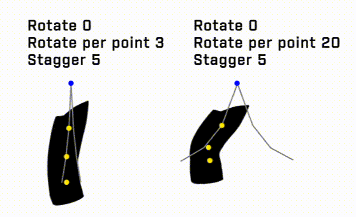

(Example is exaggerated to make it more obvious)

This adds a bit more momentum. Also useful when the layer isn't flat, (e.g. a curled tail).

## S. Puppet

*Same as swing, but the puppet pins will be rotated around the first selected puppet pin (the bottom-most selected one in the Timeline).*

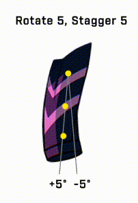

`Swing` rotates around the anchor point, but sometimes you can't move your anchor point, so use `Swing Puppet`.

Treats the first puppet pin (bottom most in timeline) as the anchor point.

# General

## Scale

*Scales the selected keyframes by a specified amount based on the range of values covered by the keyframes. (e.g. [Rotate between 90 - 110] (scale 2x) => [Rotate between 80 - 120]). Select all keyframes of a property.*

Scales the "magnitude" of a property's movement by a factor. For example, a scale of 2x would increase the movement roughly 2x.

Scale is useful if you want to quickly make something move the same way, just "less" or "more". Scale <1 to make something move less, and scale >1 to make it move more.

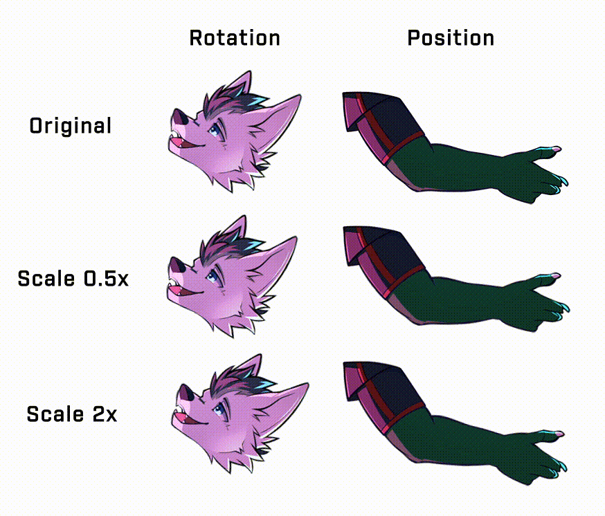

Scale can also be applied to multiple properties at once, simply select all the keyframes across multiple properties. This gives the same result as doing them one by one.

## Loop Cmp

*Makes the current layer loop between a specified start and end time, adding a crossfade at the end which crossfades to the beginning. Select a layer (preferably a precomp with no keyframes).*

Makes a layer loop by crossfading the end of the layer with the start of the layer. Specify when the loop should start and end in seconds.

I use this for VFX such as particles and lighting effects that don't support loops:

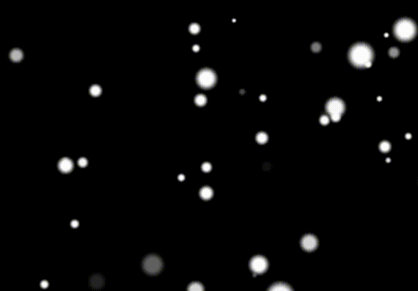

I recommend precomping your layer before trying to loop it.

Note: The start time needs to be at least 1s.

## Loop Evo

*Attempts to loop the effects of some stock After Effects plugins (i.e. sets the Evolution, Cycle Evolution and Cycle (in Revolutions) properties). Select an effect on a layer such as Fractal Noise or Turbulent Displace.*

Sets up looping evolution on some stock After Effects plugins. In particular, it looks for these properties and sets them to loop:

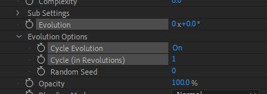

The number of revolutions is how many revolutions the Evolution property should make in a loop (e.g. two means 0° to 720°, or 0x+0° to 2x+0°). The more revolutions, the faster the animation.

## Clear Exp

*Clears the current expression on the selected properties.*

Sets the expression on all selected properties to nothing.

## Add Noise

*Adds a looping Fractal Noise layer.*

One click shortcut for adding a layer with looping Fractal Noise. Revolutions specify the number of revolutions the Evolution should make, like in [Loop Evo](#loop-evo).

## Slider

*Given a property (or multiple properties) that has 2 keyframes, a start and an end position, links it to a slider control so the property will move from start to end as the slider moves from 0 - 1. Select any number of properties with exactly two keyframes.*

A poor man's [Joysticks and Sliders](https://aescripts.com/joysticks-n-sliders/). ¯\\(ツ)/¯

Used for tying multiple property animations to a single property to be animated. For example, multiple puppet pins on a layer.

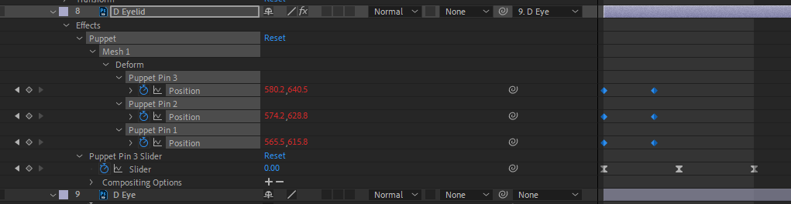

Set up a Start and an End keyframe for each property, then select them and click 'Slider'. A Slider control would be created which can be animated between 0
and 1, and the tied property will move from Start to End respectively.

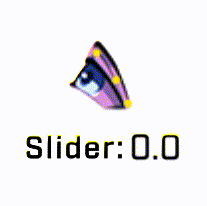

Start is always the first keyframe and End is always the second, regardless of where they are in the timeline.

## Wiggle

*Adds a looping wiggle with the given frequency and amplitude. Select any number of properties.*

Applies AE's `wiggle` expression, but looping.

If you're unfamiliar, `wiggle` takes in a frequency and an amplitude.
- Frequency controls how fast it moves
- Amplitude controls how much it moves

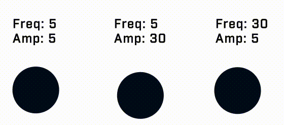

Other than the looping it's exactly the same.

# Experimental

This section contains scripts that are rarely used, extremely specific and that probably seemed like a good idea at the time. Feel free to skip it.

## Parallax

*Sets up fake parallax on 2D layers without using a camera. Select any number of layers. Use the X and Y properties on the new layer to control the camera, and the added slider on each layer denotes the distance from the camera. Probably don't use this.*

Select a bunch of layers and click Parallax. This creates a new layer representing a fake camera whose X, Y position can be controlled, and a slider on each selected layer which represents that layer's distance from the camera.

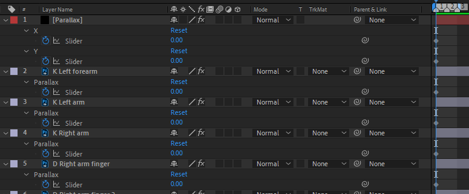

This lets you do a fake parallax effect while keeping layers 2D. (Why? To be honest I don't remember)

## Chain

*Given two parent puppet pins positioned at two corners of a rectangle, chains all other puppet pins so their X and Y position stays relative to their position in the rectangle. Select any number of puppet pins, the two bottom-most puppet pins in the Timeline will be the parents.*

Chain forces puppet pins to move relative to a grid defined by two parent puppet pins. In the following, only the two blue puppet pins are animated:

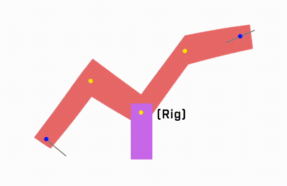

Basically, it's intended to simulate the animation as if the chained puppet pins aren't there at all. This lets you place arbitrary puppet pins in places without affecting the animation, for use as link or rig targets (see purple rectangle). This doesn't come up much, though.

## Create Ref

*Links each selected puppet pin's position to a new null object's position. Helpful for stacking position animations. Select any number of puppet pins on a single layer.*

A problem I face is wanting to "add" two movement animations together, for example, the chest should swing back and forth while idle, but also move forward drastically when the pose changes. It's a bit unwieldy to animate both of these using the same string of keyframes. A solution for this is to link a puppet pin with animation to a null which also has animation, and this script does something like that.

Select the puppet pins you want to create refs for. This creates a null object for each puppet pin which can have its own movement animation.

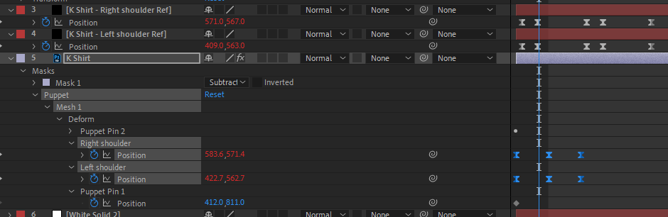

The null's animation will be added to the puppet pin's animation. This lets you animate two sets of keyframes for one position property.

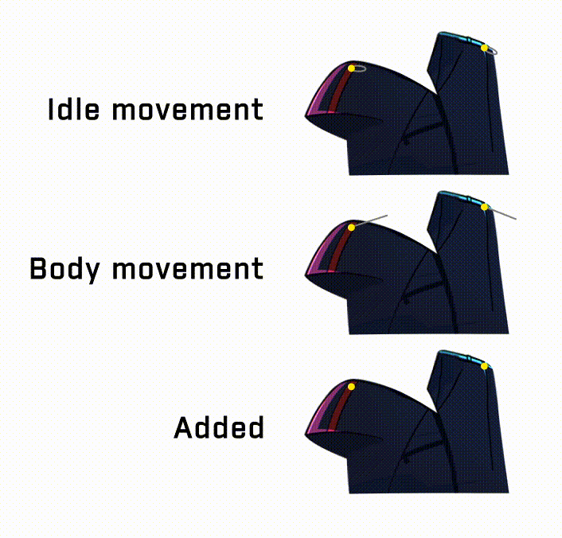

You can also just precomp, but that might break rigging.

## Stitch

*Stitches two layers together so each child layer's puppet pins are linked (same as Link button) to a puppet pin on the parent layer if they are close enough. Place puppet pins in the same locations on two layers, and select the two layers.*

Like the name implies, good for stitching two layers together like two pieces of cloth.

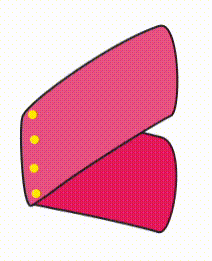

Add puppet pins on both your layers at (roughly) the same positions, then select the layers (not the pins) and click Stitch. The script will autodetect pairs of pins that are at the same position (or close enough) and call [Link](#link) on each pair.

## Round

*Attempts to round the corners of a position animation. The roundness is determined by the Round % variable in settings. Select any Position property's keyframes.*

Used by [Move Arc](#move-arc) to round out the handles. I left an option to run this step manually just in case.

## Graph Spd

*Easy ease always causes puppet pins to come to a stop at a keyframe. Bumps up the speed graph keyframes slightly so the puppet pin never has 0 speed. The minimum speed is determined by the Speed % variable in settings. Select any property's keyframes.*

Used by [Move Arc](#move-arc) to round out the handles. I left an option to run this step manually just in case.

# Settings

## Loop Length

The length of your loop in seconds. Every script that generates looping keyframes will use this as the duration.

## Speed %

This setting is used by [Move Arc](#move-arc). It affects the minimum speed at the extremes of the arc. The higher the setting, the more higher the minimum speed at the points of the arc.

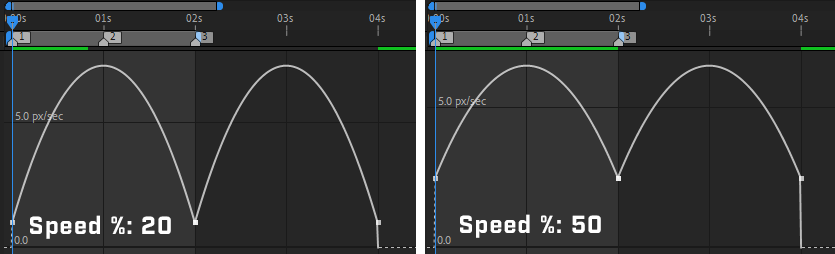

The above shows the Speed Graph of two animated puppet pins.

## Round %

This setting is used by [Move Arc](#move-arc). It affects the roundness of the handles of the arc. The higher the setting, the rounder the arc will be.

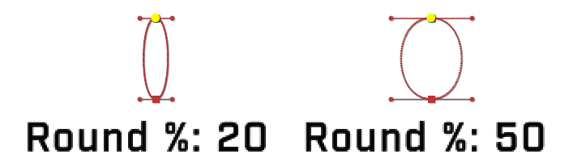

## Flip Handles

This setting is used by [Move Arc](#move-arc). When checked, it flips the direction of the arc.

By default:
- If the clock direction > 6, the arc will move counter clockwise.
- If the clock direction <= 6, the arc will move clockwise.

# Etc

## Optimization Tips

Small things I added in to make usage slightly easier at the cost of intuitiveness.

### Parenting

- For functions that require a child and parent pin (like pair pin or link), if a puppet pin with a default name (like Puppet Pin 3) and a puppet pin with a non-default name (like Head or Jaw) is selected, the default named puppet pin will be assumed to be the child, e.g. 
