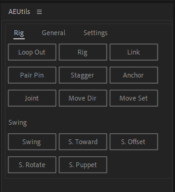

# User Documentation

- [User Documentation](#user-documentation)
- [Foreword](#foreword)
- [Using the Plugin](#using-the-plugin)
  - [Errors](#errors)
- [Rig](#rig)
  - [Loop Out](#loop-out)
  - [Rig](#rig-1)
  - [Link](#link)
  - [Pair Pin](#pair-pin)
  - [Stagger](#stagger)
  - [Anchor](#anchor)
  - [Joint](#joint)
  - [Move Dir](#move-dir)
  - [Move Set](#move-set)
  - [Swing](#swing)
  - [S. Toward](#s-toward)
  - [S. Offset](#s-offset)
  - [S. Rotate](#s-rotate)
  - [S. Puppet](#s-puppet)
- [General](#general)
  - [Scale](#scale)
  - [Loop Cmp](#loop-cmp)
  - [Loop Evo](#loop-evo)
  - [Clear Exp](#clear-exp)
  - [Add Noise](#add-noise)
  - [Slider](#slider)
  - [Wiggle](#wiggle)
  - [Parallax](#parallax)
  - [Chain](#chain)
  - [Skeleton](#skeleton)
  - [Stitch](#stitch)
  - [Round](#round)
  - [Graph Spd](#graph-spd)
- [For Developers](#for-developers)

# Foreword

I use After Effects for creating idle animated loops. This involves cutting up existing artwork into layers in Photoshop, rigging them in After Effects and then finally animating them. It's not a complicated process, but I faced a few problems:

- Layer management: An average project will have about ~50 layers. Many animation workflows require you to create more, and it made finding specific objects painful.
- Rigging: Standard rigging methods take a long time to setup. The resultant rig is powerful but it's not needed for a simple idle loop.
- Repititive work: There's a lot of repititive work which is really boring, and makes animating a drag.

Many existing workflows are targeted towards traditional animation (like walk cycles, etc.) which is not really suited to this use case. As such, I created this plugin with these goals in mind:

- Keep the workspace clean. Build functionality in a way that doesn't add new objects to manage (like layers and comps).
- Keep it simple. Make rigging and movement doable in just a few clicks.
- Automate the unimportant stuff. The 80:20 rule - 80% of the result comes from 20% of the work. For the rest? Automate it.

Most importantly, I believe in optimizing effort **and** time. A good result that can be automated in a second is better than a perfect result that takes an hour to do manually. I'll admit doing it manually will still give the best result, but for me minimizing time spent goes a long way in preventing burnout.

# Using the Plugin

The plugin consists of buttons each linked to a script or functionality. To use a script, select the required properties in the timeline panel and click on the respective button.

Tips:
- Hover over a button to see a description of what it does.
- Buttons will usually require you to select some thing(s) in the timeline before clicking the button.
    - Hovering over a button will tell you what needs to be selected, e.g., the Anchor button will require you to select a puppet pin.
    - An error will show if the selection is incorrect.
- Some buttons require user input (in a specific format). Check each script's documentation for what it expects.

- Some buttons will read a value from the Settings tab which will affect functionality, such as the loop length. Check each script's documentation for which settings are read.

## Errors

If you're encountering errors:

- IMPORTANT: This plugin was intended to be used on Photoshop layers, most rigging functionality will only work on layers imported on photoshop (i.e. the layer size is the same as the composition). As such many rigging functions won't work on layers whose height and width does not match the composition.
    - Ensure that you import your .psd is imported as `Composition`, and not `Composition - Retain Layer Sizes`.

- Check that you've selected the correct properties.
- Check that you haven't accidentally selected just the property's parent. For example, if the script needs a Position property selected, you will need to select the property specifically:

- Check that the settings and inputs are valid. Read each script's documentation for more information.

# Rig

The rig plugin contains functionality based on rigging layers together. It provides a simple rigging engine based off puppet pins and property expressions.

*IMPORTANT: This plugin was intended to be used on Photoshop layers, most rigging functionality will only work on layers imported on photoshop (i.e. the layer size is the same as the composition). As such many rigging functions won't work on layers whose height and width does not match the composition.*

## Loop Out

*Sets loopOut() on all selected properties with at least two keyframes and no expression.*

Sets the all selected properties to `loopOut()`, which makes the keyframes loop endlessly. I slap this on everything.

Only affects properties that are animated (i.e. 2 or more keyframes), and does not overwrite existing expressions.

## Rig

*Rigs a layer to a puppet pin on another layer. Select a layer and a puppet pin.*

The rig function rigs a layer to a puppet pin on another layer. You can think of it as advanced parenting, where the child layer not only inherits the parent's Transform properties, but also the movement of the puppet pin:

This can be used as a basis for creating a simple skeleton. The Body is rigged to the Legs, the Arms and Neck to the Body and the Head to the Neck and so on.

## Link

*Links a puppet pin (child) to another puppet pin's (parent) absolute position, ignoring all parenting. Select two puppet pins on different layers.*

This forces a puppet pin to always be at the same position as a different puppet pin on a separate layer.

To use it, place two puppet pins on two layers at the same position. Then, select them both and clink 'Link', and it will ask you to confirm which is which. The child pin will be linked to the parent pin.

This is handy for joining layers at multiple points, thus allowing them to feel more connected.

The head is rigged to the neck's upper right pin. The jaw puppet pin on the neck is linked to a puppet pin placed on the head, resulting in a smoother looking connection.

*Tip: For convenience, if a puppet pin with a default name (like Puppet Pin 3) and a puppet pin with a non-default name (like Head or Jaw) is selected, the default named puppet pin will be assumed to be the child.*

## Pair Pin

*Pairs a puppet pin (child) to another puppet pin (parent) so the child pin moves with the parent. Select two puppet pins on the same layer.*

Pair pin allows for puppet pin level parenting. It forces a puppet pin (child) on a layer to move relative to a different puppet pin (parent) on the same layer. Multiple child pins can be parented to one parent pin.

Additionally, if the child pin has its own animation and the movement will be stacked, much like layer parenting. 

Note: After Effects glitches out a bit if you try to move child pins that have already been parented. You have to adjust the position in the timeline, or animate the child pin first before animating. I can't find a fix.

*Tip: For convenience, if a puppet pin with a default name (like Puppet Pin 3) and a puppet pin with a non-default name (like Head or Jaw) is selected, the default named puppet pin will be assumed to be the child.*

## Stagger

*Staggers the start time of animated properties so their first keyframe starts at 0, n, 2n, 3n... etc. frames. Select multiple properties with keyframes.*

This is used to offset the start times of multiple selected properties. The lowest selected property will be the earliest.

Staggering start times of looping keyframes is a lazy way of adding momentum. You'll see this used in `Swing` as well.

## Anchor

*Anchors a puppet pin to its current position on the composition so it does not move. Select 1 or more puppet pins.*

This forces a puppet pin to stay stationary in the composition regardless of how the layer moves. Helpful for fixing a part of a layer to a point (say a hand leaning on a wall).

If you select `Movable Anchor`, the anchor will be attached to a null object instead, which can be animated independently.

## Joint

*Sets up inverse kinematics on the selected puppet pins. Select 3 (Anchor, Joint, Controller) or 4 (Anchor, Joint, Inner Joint, Controller) puppet pins. Please see the user guide for more information.*

Joint sets up a quick and dirty 2 joint IK, useful for animating limbs. Imagine animating an arm, and being able to simply animate the position of the wrist while the elbow position is automatically calculated. In each of the following, only the wrist is animated with keyframes:

Start by placing specific puppet pins on your arm layer(s). These are:
- Anchor: The shoulder, also the anchor point of the limb
- Joint: The elbow, where the two halves of the arm connect
- Inner joint (optional): Paired to the joint, allowing a smoother connection
- Controller: The wrist, which can be animated

Select either the 3 (Anchor, Joint, Controller) or 4 (Anchor, Joint, Inner joint, Controller) puppet pins, and click Joint to rig them up.

Additionally, the forearm and arm can be on separate layers. This will instead create a null object which the controller is attached to. The null's position can be animated.

Do note:
- Joint and Inner Joint points must be placed on BOTH layers at approximately the same position.
- When selecting Joint and Inner Joint, select only the points that are on the same layer as the anchor.

Here's how the selection should be done before `Joint` is clicked:
- (Top Left) Arm and forearm on same layer. No inner joint
  
    
- (Bottom Left) Arm and forearm on same layer. Inner joint
  
    
- (Top Right) Arm and forearm on separate layers. No inner joint
  
    
- (Bottom Right) Arm and forearm on separate layers. Inner joint
  
    

## Move Dir

*Creates a 2 keyframe loop that moves the selected item's position by a fixed amount of pixels, in a fixed direction (0 - 12, like a clock face). Select any Position property (layer Position or puppet pin Position).*

## Move Set

*Creates a 2 keyframe loop that animates the selected property's value between two given values (e.g. 10;20). Select any animatable property.*

## Swing

*Creates a 2 keyframe loop that rotates puppet pins back and forth around the layer's anchor point. The degree specifies how much to move and the stagger specifies the delay between each puppet pin's animation. Select any number of puppet pins on a layer. *

## S. Toward

*Same as swing, but the puppet pin moves toward and away from the anchor point instead of rotating around.*

## S. Offset

*Same as swing, but you can specify the start and end degrees. E.g. (0 to 12 instead of -6 to 6).*

## S. Rotate

*Same as swing, but each puppet pin will be rotated around the previous puppet pin by a specified amount. Puppet pins are ordered from bottom to top by how they're displayed on the Timeline.*

## S. Puppet

*Same as swing, but the puppet pins will be rotated around the first selected puppet pin (the bottom-most selected one in the Timeline).*

# General

## Scale

*Scales the selected keyframes by a specified amount based on the range of values covered by the keyframes. (e.g. [Rotate between 90 - 110] (scale 2x) => [Rotate between 80 - 120]). Select all keyframes of a property.*

## Loop Cmp

*Makes the current layer loop between a specified start and end time, adding a crossfade at the end which crossfades to the beginning. Select a layer (preferably a precomp with no keyframes).*

## Loop Evo

*Attempts to loop the effects of some stock After Effects plugins (i.e. sets the Evolution, Cycle Evolution and Cycle (in Revolutions) properties). Select an effect on a layer such as Fractal Noise or Turbulent Displace.*

## Clear Exp

*Clears the current expression on the selected properties.*

## Add Noise

*Adds a looping Fractal Noise layer.*

## Slider

*Given a property (or multiple properties) that has 2 keyframes, a start and an end position, links it to a slider control so the property will move from start to end as the slider moves from 0 - 1. Select any number of properties with exactly two keyframes.*

## Wiggle

*Adds a looping wiggle with the given frequency and amplitude. Select any number of properties.*

## Parallax

*Sets up fake parallax on 2D layers without using a camera. Select any number of layers. Use the X and Y properties on the new layer to control the camera, and the added slider on each layer denotes the distance from the camera. Probably don't use this.*

## Chain

*Given two parent puppet pins positioned at two corners of a rectangle, chains all other puppet pins so their X and Y position stays relative to their position in the rectangle. Select any number of puppet pins, the two bottom-most puppet pins in the Timeline will be the parents.*

## Skeleton

*Links each selected puppet pin's position to a new null object's position. Helpful for stacking position animations. Select any number of puppet pins on a single layer.*

## Stitch

*Stitches two layers together so each child layer's puppet pins are linked (same as Link button) to a puppet pin on the parent layer if they are close enough. Place puppet pins in the same locations on two layers, and select the two layers.*

## Round

*Attempts to round the corners of a position animation. The roundness is determined by the Round % variable in settings. Select any Position property's keyframes.*

## Graph Spd

*Easy ease always causes puppet pins to come to a stop at a keyframe. Bumps up the speed graph keyframes slightly so the puppet pin never has 0 speed. The minimum speed is determined by the Speed % variable in settings. Select any property's keyframes.*

# For Developers
